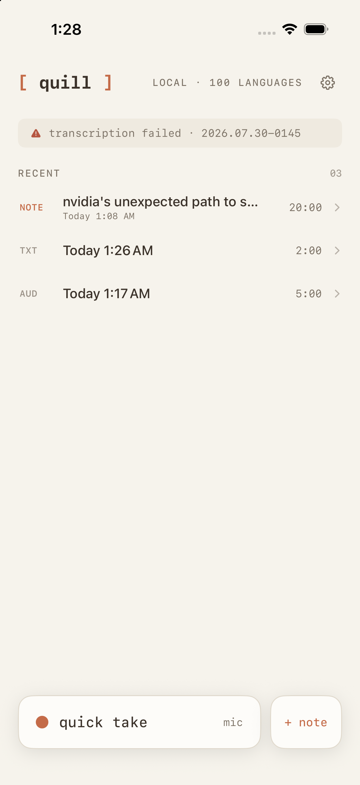
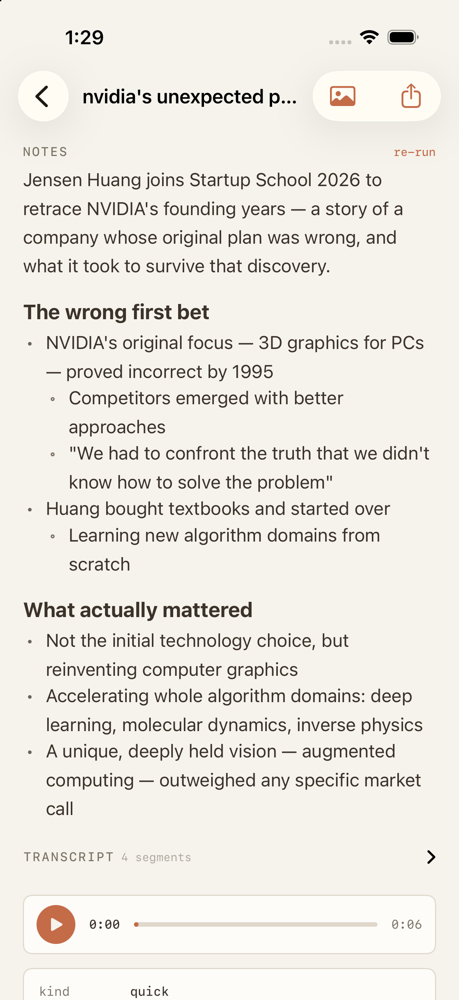
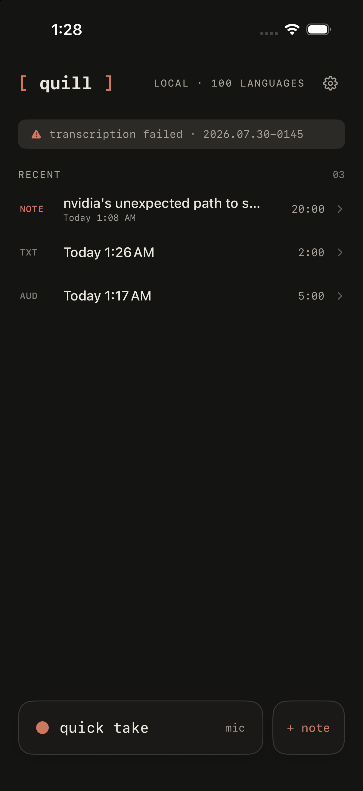

# [ quill ]

Local-first voice notes for Apple platforms. Record → transcribe →
structured markdown notes, entirely on your device. No account, no cloud,
no subscription — every session is a folder you own in Files.

| | |
|---|---|
| **quill-ios/** | iPhone app — the main product. WhisperKit transcription (~100 languages), Apple Intelligence notes with a local Qwen fallback, speaker diarization, Live Activity, playback, one-tap organized notes. |
| **quill-app/** | macOS menu-bar sibling. Records mic + system audio (both sides of a call), same session-folder schema, `claude -p` notes structuring. |
| **DESIGN.md** | The shared design language (kobe DNA: porcelain / espresso / terracotta, mono kickers, bracket-chip wordmark). |

## Why it's fast and cheap

- **Everything on-device**: Whisper large-v3 turbo via Core ML on the
  Neural Engine (~3s per 8s of audio), Apple's system LLM for notes —
  zero API cost, zero audio leaving the phone.
- **Concurrent by budget**: decode workers scale to the memory actually
  available (`os_proc_available_memory`-driven), so long files parallelize
  without jetsam.
- **Batch + checkpoint pipeline**: sessions queue serially; each file is
  sliced adaptively (~8 progress steps), every slice checkpointed — a kill
  mid-hour-long file resumes where it stopped.
- **Speaker separation**: FluidAudio's offline diarizer labels multi-voice
  transcripts S1/S2/… fully locally.
- **Dynamic Island / Live Activity**: recording shows a live timer +
  waveform; transcription shows a spinner + real percentage.

## Reference

quill is a direct extension of — and entirely inspired by —
[digimata/quill](https://github.com/digimata/quill), the minimal macOS
meeting recorder (vendored under `ref/quill`). The audio capture core,
session-folder contract, and "folders you own" philosophy come straight
from it. [kylelegare/tape](https://github.com/kylelegare/tape) informed
the app-bundle packaging, and the visual language is inherited from
[kobe](https://github.com/Sma1lboy/kobe). Thanks to all three.

## Screenshots

  
  
  

## Roadmap

Multi-device sync (Mac ↔ iPhone via the shared folder schema), speaker
naming, image understanding woven into notes. See `quill-ios/TODO.md`.
